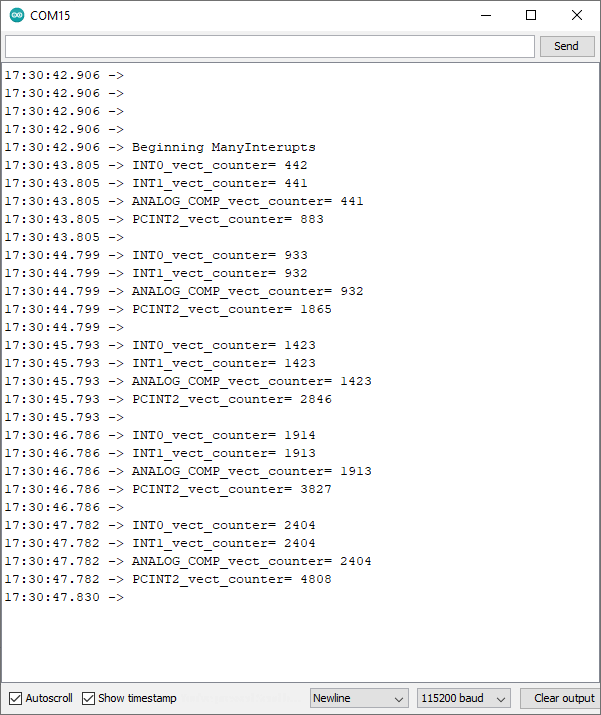
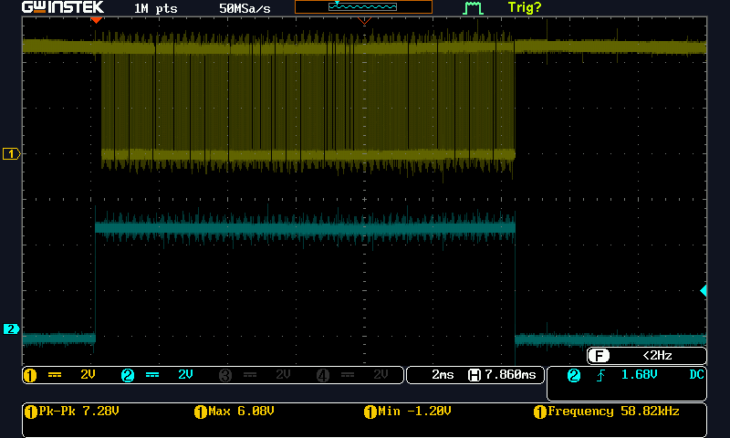

# ManyInterupts
A program to exercise many interrupts on UNO 

Terminal showing four counters counting as a frequencey counter. 
Terminal showing the count of the UART TX bursts as this terminal got UART data.  

Osciiliscope capture of UART output and DE for RS-485 output enable. 
  
Ch1 is UART TX output. CH2 is DE  

